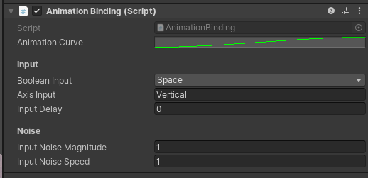

# e→d films Animation Bindings
### Customizeable input system to puppeteer animation inside of Unity 

### About
This proposed animation system values and embraces the real time, human user interface driven nature of game engines and strives to use that to craft naturalistic, organic animation with unprecedented ease and speed. The director becomes a puppeteer, actively embodying every important, living creature and acted entity on set. They will sculpt a nuanced performance one pass at a time. 

While this idea is nothing new, we have a clear vision on how to make it easily understandable and accessible to artists and generalists based on years of animating quality film content with extremely tight budgets and technical/artistic teams as small as one person.

This tool is geared toward both 3D and 2.5D animation techniques where the game engine serves first and foremost as a powerful performance driven, animation tool.

### Basic Components & Workflow

At the simplest level, the *Animation Bindings* system allows the animator to easily set up and control various properties of a game object, whether it be its position, rotation or more exotic properties like its shader parameters or MonoBehaviour components. 

- An **Animation Binding** component is created and set up. Inside of the component, the user can not only adjust what will it output (whether it be pure numerical values or C# events) but how it is interacted with. Any input set-up from inside of Unity's input system is compatible, from keyboard input to VR motion controllers. 

- Auto-named and organized, a single scene will eventually contain a "stack" of animation bindings; a digital control bar for your virtual Unity puppets.

- On the various limbs and possessions of your puppets, the user can add **Animation Link** components that can fetch data from their associated Animation Binding component and affect the game object in various way. At runtime, IK targets twist and turn, particle systems flash and shaders wax and wane at the user's touch. With no limit on how many Animation Link components you can have on a single game object, extremely complex animation setups can be devised. For ease of use, many useful C# events like particle bursts, object spawning or parenting operations have been already integrated in the **Common Events** component you can add as a companion to your Animation Links.

- The scene set up, the user can can either bake down the ensuing animations with the [Unity Recorder](https://unitytech.github.io/unity-recorder/manual/index.html), [Alembic Exporter](https://docs.unity3d.com/Packages/com.unity.formats.alembic@1.0/manual/time_InfiniteClip.html) for use in linear content or keep their animation system runtime-ready for interactive experiences.

### Extending the System

Relying on only three components, the Animation Bindings is easily extendable if you require more control over niche game object parameters. both the Animation Link and Common Events script are well documented and can be easily appended without issue. 

Crafted by [Alexis Morin](https://github.com/alexismorin) in friendly partnership with [e→d films](https://edfilms.net/)
